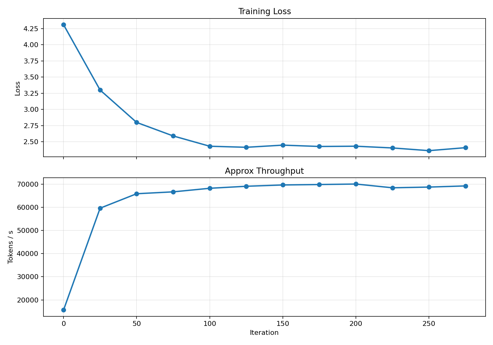
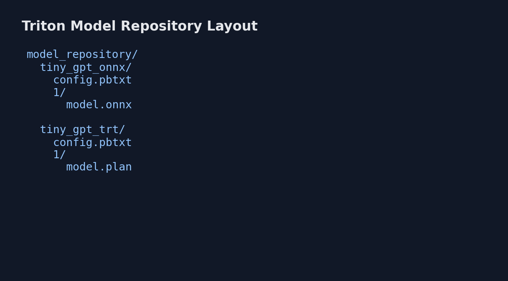

# GPU / LLM Infra Lab

Compact experiments for model training, inference export, and distributed-systems baselines on commodity hardware.

## What Is Included

- `train.py`: TinyGPT char-level training with AMP, gradient accumulation, and optional DDP.
- `train_fsdp.py`: minimal FSDP wrapper entrypoint for sharding strategy experiments.
- `bench_gpu.py`: FP16/FP32 matmul and MLP throughput micro-benchmarks.
- `bench_collectives.py`: collective communication baseline (`all_reduce` or local reduction fallback).
- `export_onnx.py`: ONNX export path for TensorRT / Triton serving pipelines.
- `infer_quant.py`: dynamic quantization latency comparison on CPU.
- `scheduler_sim.py`: simple scheduler policy simulation (FIFO vs greedy packing).

## Environment

```bash
cd gpu-llm-infra-lab
python -m venv .venv
.venv\Scripts\activate
pip install -U pip
pip install torch --index-url https://download.pytorch.org/whl/cu124
pip install -e .
pip install onnx matplotlib
```

## Public Dataset

The repository now includes a public corpus download helper:

```bash
python -m gpu_llm_infra_lab.fetch_data --dataset tinyshakespeare --out data/tinyshakespeare.txt
```

Source: [Karpathy tiny Shakespeare](https://raw.githubusercontent.com/karpathy/char-rnn/master/data/tinyshakespeare/input.txt)

## Reproducible Runs

### 1) Train on Tiny Shakespeare

```bash
python -u -m gpu_llm_infra_lab.train --config configs/tinyshakespeare.yaml --max-iters 300 --out_dir runs/tinyshakespeare_300 | Tee-Object -FilePath runs/tinyshakespeare_300/train.log
```

### 2) Plot Loss / Throughput Curve

```bash
python -m gpu_llm_infra_lab.plot_training --log runs/tinyshakespeare_300/train.log --out artifacts/train_curve_tinyshakespeare.png
```

### 3) Export ONNX + Quantization Check

```bash
python -m gpu_llm_infra_lab.export_onnx --ckpt runs/tinyshakespeare_300/ckpt_final.pt --out artifacts/tiny_gpt.onnx
python -m gpu_llm_infra_lab.infer_quant --ckpt runs/tinyshakespeare_300/ckpt_final.pt --steps 100
```

### 4) GPU / Communication Baselines

```bash
python -m gpu_llm_infra_lab.bench_gpu
python -m gpu_llm_infra_lab.bench_collectives
python -m gpu_llm_infra_lab.scheduler_sim --gpus 4
```

### 5) FSDP Wrapper (Single-Node Sanity)

```bash
python -u -m gpu_llm_infra_lab.train_fsdp --config configs/default.yaml --max-iters 80 --force-fsdp --out_dir runs/compare_fsdp1
```

## Latest Local Results

Hardware and software (local run):

- GPU: NVIDIA GeForce RTX 2060 (6GB), driver 591.59
- Python: 3.13.8
- CUDA path verified by `bench_gpu` device detection

Observed numbers from current runs:

- `bench_gpu`:
  - FP16 `4096x4096`: ~7.49 ms, ~18.36 TFLOP/s
  - FP32 `4096x4096`: ~27.13 ms, ~5.07 TFLOP/s
  - MLP fp32: ~7.18 ms/step, AMP fp16: ~2.67 ms/step
- `train` (`tinyshakespeare`, 300 iters):
  - loss: 4.31 -> 2.36
  - throughput: ~60k to ~70k tokens/s
- `infer_quant` (CPU, 100 steps):
  - fp32 eager: ~5.73 ms/forward
  - dynamic quant: ~7.05 ms/forward
- `bench_collectives` single-process baseline:
  - ~66.8 ms/iter for ~50M float elements local reduction path
- `train_fsdp --force-fsdp` (single-process sharding sanity):
  - ~47.8k tokens/s at iter 50

## Artifacts (Included in Repo)

- Training curve:



- Triton model-repository layout snapshot:



## Triton Repository Skeleton

A minimal Triton model repository is provided under:

- `deploy/triton/model_repository/tiny_gpt_onnx`
- `deploy/triton/model_repository/tiny_gpt_trt`

Use `config.pbtxt` as templates and place the actual model files in version folder `1/`.

## TensorRT `trtexec`

If `trtexec` is installed on your machine:

```bash
trtexec --onnx=artifacts/tiny_gpt.onnx --saveEngine=artifacts/tiny_gpt_fp16.plan --fp16 --memPoolSize=workspace:1024
```

Add measured latency from your machine to this README once available.

## Multi-Node Communication Notes

`bench_collectives.py` currently records a single-node baseline. For NVLink / PCIe / RDMA comparisons, run the same script across the target environments and append the results in table form (same tensor shape, same iteration count) for fair comparison.

## License

MIT. See `LICENSE`.
